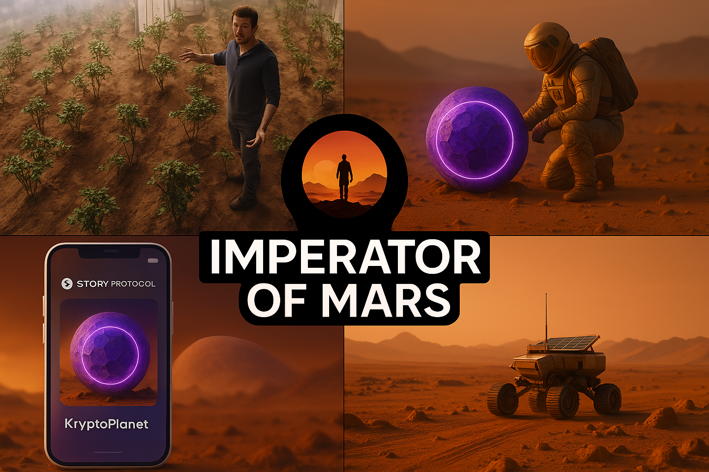

# Imperator of Mars: A Framework for Collaboratively Created Worlds with Provable Logical Consistency

## Problem

While Large Language Models (LLMs) have emerged as powerful tools in creative fields, issues like 'hallucination' and logical inconsistency limit their use in tasks requiring high fidelity. Additionally, large-scale collaborative projects involving multiple creators face challenges in maintaining content consistency, verifying contributions, and managing intellectual property (IP) rights.

## Solution: First-Order Logic is all you need.

Imperator of Mars is a proposed framework designed to address these problems. Its core technologies include:

1.  **First-Order Logic (FOL) Foundation:** Defines world rules and settings using mathematically precise First-Order Logic (FOL), eliminating ambiguity and providing a logical foundation.
2.  **Automated Consistency Verification:** When new creative content (story developments, setting additions, etc.) is proposed, FOL Agent automatically verifies if it conflicts with existing FOL rules. This prevents logical contradictions from entering the system.
3.  **Web3 Signature-Based Authorship Proof:** All contributions are submitted after being cryptographically signed with the creator's Web3 wallet private key. This provides immutable proof of who contributed what.
4.  **Story Protocol-Integrated IP Management:** Verified creative works can be registered as IP assets on the Story Protocol blockchain. This allows for transparent and automated management of IP ownership, licensing terms (Programmable IP Licenses), and royalty distribution for derivative works.

## Imperator of Mars Architecture


### 1. World Builder Fronted

- **Dashboard**: view overall story contributions
- **FOL Rules**: list of logical assertions and formulas
- **DAG visualizer**: interactive DAG graph for contributing logic

---

### 2. 🤖 Agents

#### **World Builder Agent**
- Decides high-level direction and future events.
- Example FOL:
  ```
  ∃t (Year(t) ∧ t = 2027 ∧ PossibleTravel(Mars, Earth, t))
  ```

#### **FOL Writer Agent**
- Transforms natural exploration goals into FOL representation.
- Example FOL:
  ```
  ∃x ∃y ∃a ∃t (
    Exploration(y) ∧
    Agent(a) ∧
    Time(y, t) ∧
    Location(y, WaterIce) ∧
    FoundBy(a, x, y) ∧
    IsKryptoPlanet(x)
  )
  ```

#### **Fiction Writer Agent**
- Converts FOL into readable HTML fiction (Markdown, HTML).
- Outputs files like: `0_genesis.html`

---

### 3. GitHub

#### Files
- FOL logic files (e.g. `fol/0_genesis.fol`)
- Published stories (e.g. `docs/0_genesis.html`)

#### GitHub Actions
- Automatically runs `verifyFOL()` to validate logic.
- On success: merges contributions.

---

### 4. MCP Servers (Story Protocol)

### `story-mcp`
- Once a story milestone is reached (e.g. `IsKryptoPlanet(x)`), the asset can be:
  - Minted via `Mint KryptoPlanet`
  - Stored as onchain IP using **Story Protocol**

---

### 🌐 Deployment
👉 Published Story: [https://imperatorofmars.ai](https://imperatorofmars.ai)

👉 World Builder Frontend: [https://imperator-of-mars.ainetwork.xyz/](https://imperator-of-mars.ainetwork.xyz/)


## Q&A
### Q: How can we make sure AI (LLM) story ideas follow the rules and fit the story?

**A:** We use **First-Order Logic (FOL)**. These are clear, strict rules for the world, much more precise than normal language. The system checks new ideas against these rules automatically.

* **Example from Demo:** If someone tried to say Mark launched *immediately* to Mars on a specific date (like "tomorrow" in the challenge example - April 12th, 2025), the system would check the FOL rules (e.g., a rule like `Fact: ¬LaunchWindow(Earth, Mars, "2025-04-12")`) and stop the idea if it breaks the rule, ensuring the story follows its own science about when launches are possible.

### Q: How can we help writers of all ages and skills join in?

**A:** Our **‘World Builder’** tool helps out! It gives writers helpful hints and automatically checks if their ideas follow the world's rules while they write.

* **Example from Demo:** When a less experienced writer might try an impossible action (like launching immediately), the Builder provides feedback explaining *why* it breaks a rule (e.g., "Earth and Mars are too far apart right now!"). But it allows more experienced writers to add complex details (like orbital mechanics for the journey) as long as they *follow* the established FOL rules.

### Q: How do we easily know who created an idea, maybe years later?

**A:** The **DAG** (our story's permanent record) shows the history of every contribution, linked together. Plus, using **Story Protocol**, creators can register unique ideas as their own digital property (IP) right when they create them.

* **Example from Demo:** User Echo discovered 'KryptoPlanet' (creating Node 5). They then used the Story Protocol MCP to register 'KryptoPlanet #001' as IP (creating Node 6, linked to Node 5). The DAG shows this sequence, and Story Protocol provides the on-chain proof of Echo's specific IP contribution, even if other users (F, G, etc.) add value later.

### Q: What if people disagree about where the story should go next?

**A:** No problem! The system lets writers **'fork'** the story. This means different ideas can branch off from the same point and be explored at the same time, like choosing different paths in a game.

* **Example from Demo:** Facing the food shortage (Node 2), the story could stall if people argued about farming vs. exploring. Instead, User Gamma 'forked' to create the 'Potato Farming' path (Node 3 / Branch A), and User Delta 'forked' to create the 'Water Exploration' path (Node 4 / Branch B). Both valid, but different, strategies could then be developed in parallel.

### Q: How can we be sure the story hasn't been secretly changed or messed with?

**A:** Every piece of the story is locked together in the DAG using special math tricks (**Merkle Proofs** and a master hash code called the DAG State Root). This proves the entire story history is correct and secure, like a super-strong digital seal that changes if anything is tampered with.

* **Example from Demo:** At the start, the DAG might have a State Root hash like `0xabc...def`. When Alpha added Node 1 (Mark's departure), the hash changed to `0x123...456`. When Beta added Node 2, it changed again. This constantly updating hash proves the integrity of the *entire* chain of events. Anyone can use a Merkle Proof to verify that a specific node (like Node 1) is authentically part of the history represented by the latest root hash.

---
## Demo
[Go to DEMO.md](DEMO.md)


