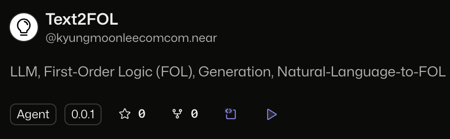
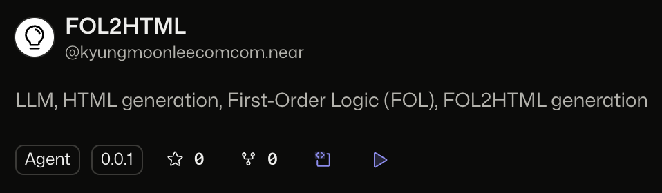

# NEAR AI Bounty

# Req1: Agent must be hosted on the [NEAR Agent Hub](https://app.near.ai/agents)

## Uploaded URL hosted by NEAR Hub: https://app.near.ai/profiles/kyungmoonleecomcom.near

## Agent ["Text2FOL"](https://app.near.ai/agents/kyungmoonleecomcom.near/Text2FOL/latest)
<p align="center">
  
</p>

## Agent ["FOL2HTML"](https://app.near.ai/agents/kyungmoonleecomcom.near/FOL2HTML/latest)
<p align="center">
  
</p>

# Req2: "Code must be in a public repository

## 🔍 Actual Codes
### [./world-builder/src/app/page.tsx](https://github.com/ainize-team/imperatorofmars/blob/main/world-builder/src/app/page.tsx#L123-L140)
```typescript
const getFOL = async (input: string) => {
  // TODO(kyungmoon): get FOL data using "src/app/api/gen-fol/route.ts" using input 
  console.log("FRONT-END input :>> ", input);
  try {
    const response = await fetch('/api/gen-fol', {
      method: 'POST',
      headers: { 'Content-Type': 'application/json' },
      body: JSON.stringify({ message: input }),
    });

    const result = await response.json();
    return result;
  } catch (error) {
    console.error("Error fetching FOL data:", error);
    toast.error("Failed to fetch FOL data.");
    return;
  }
}
```

### [./world-builder/src/app/api/gen-fol/route.ts](https://github.com/ainize-team/imperatorofmars/blob/main/world-builder/src/app/api/gen-fol/route.ts#L17-L44)
```typescript
const threadResponse = await fetch("https://api.near.ai/v1/threads/runs", {
  method: "POST",
  headers: {
    "Content-Type": "application/json",
    "Authorization": `Bearer ${JSON.stringify(authPayload)}`
  },
  body: JSON.stringify({
    agent_id: "kyungmoonleecomcom.near/TEXT2FOL/0.0.1", 
    new_message: message,
    max_iterations: "1"
  })
});

const threadResult = await threadResponse.text();

// Extract the thread_id from the response
const threadId = threadResult.replace(/["%]/g, '').trim();

// Send a request to the NEAR API to get the messages in the thread
const messageResponse = await fetch(`https://api.near.ai/v1/threads/${threadId}/messages`, {
  method: "GET",
  headers: {
    "Content-Type": "application/json",
    "Authorization": `Bearer ${JSON.stringify(authPayload)}`
  }
});
```

# Req3: "Quantitative Benchmarks for Agent Performance" (TBD)
## 에이전트 조합에 대한 성능 테이블이 보여질 예정이며, [튜토리얼](https://docs.near.ai/models/benchmarks_and_evaluations) 보고 적용 예정.
