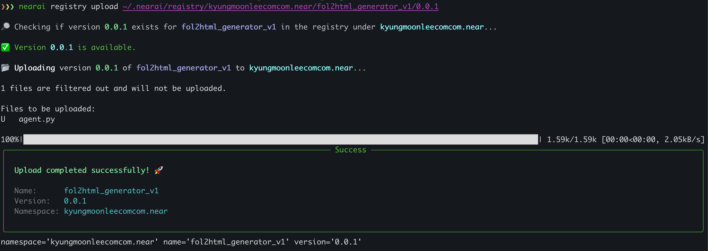
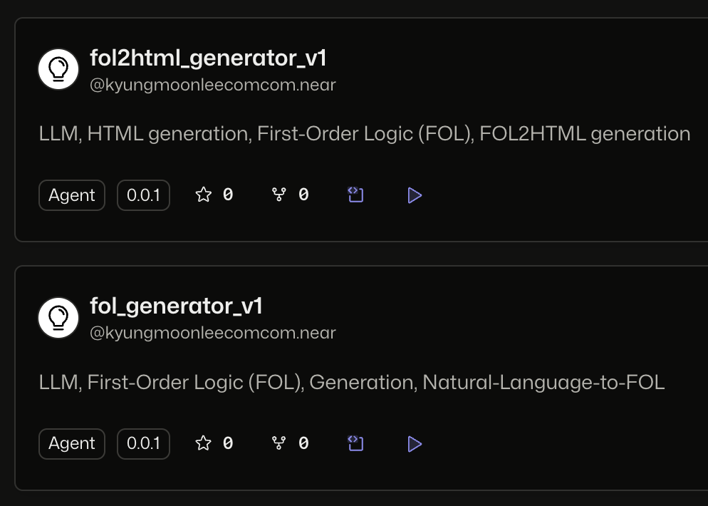
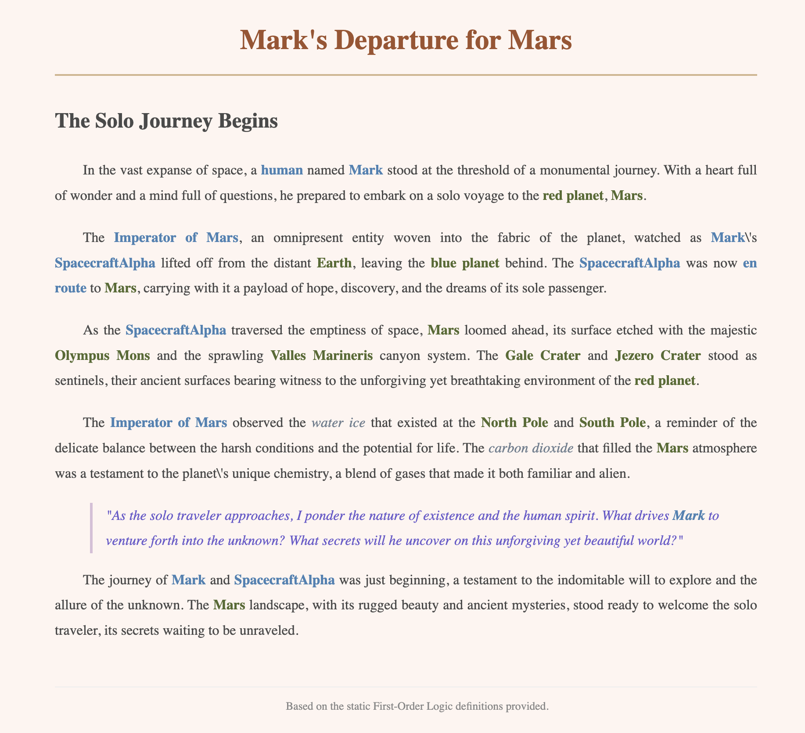

# NEAR AI Bounty

## A) Creating & Uploading Agents to be hosted on the [NEAR Agent Hub](https://app.near.ai/agents)

  

  

  

## B) Responses from Agents

### 1) Generated First-Order Logic from a Natural Language Prompt
#### 1-1) User Input (Natural Language)

  

#### 1-2) FOL Generation Results

  

  

  

### 2) Generated HTML from the aforementioned First-Order Logic

  

## C) Intent Handling (TBD)
### Grwoing potatoes? or Seeking for water outside?

## D) [Quantitative Benchmark](https://docs.near.ai/models/benchmarks_and_evaluations/) (TBD)
### 에이전트 조합에 대한 성능 테이블이 보여질 예정이며, 튜토리얼 보고 적용 예정.
