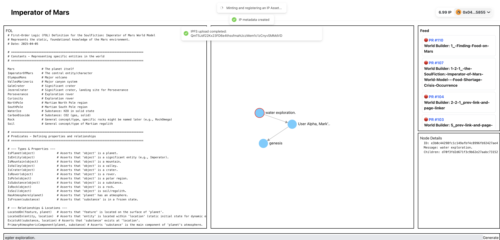

# Story Bounty - Imperator of Mars

Preserve and protect creative **Content IP** assets using Story Protocol

## Overview

Our project enables builders to **mint and register their creative assets** as protected IP on the blockchain using **Story Protocol**.

During the hackathon, we implemented this functionality end-to-end—from **IPFS asset upload**, to **NFT minting**, to **IP registration** via the Story SDK.

By safeguarding the ownership of the **creative building blocks** they produce, we aim to empower a future where IP attribution and licensing are **fair, transparent, and reward creators appropriately**.

## Features

- Upload creative assets to IPFS
- Mint assets as NFTs via Story Protocol
- Register NFTs as formal IP in the Story Blockchain
- Set commercial-remix licensing with derivative works support
- Verify ownership through MetaMask

## How It Works

### 0. Discover New Creative Asset  
Identify a new idea, character, or narrative component that deserves preservation and protection.  


### 1. Upload Asset to IPFS  
Upload your digital assets to IPFS for permanent storage.  


```ts
export async function uploadImageToIPFS(data: FormData) {
  const pinFileRes = await fetch("https://api.pinata.cloud/pinning/pinFileToIPFS", {
    method: "POST",
    headers: {
      Authorization: `Bearer ${process.env.PINATA_JWT}`,
    },
    body: data,
  });
  const { IpfsHash } = await pinFileRes.json();
  return IpfsHash;
}

export async function uploadJsonToIPFS(data: Record<string, any>) {
  const pinata = new pinataSDK({ pinataJWTKey: process.env.PINATA_JWT });
  const { IpfsHash } = await pinata.pinJSONToIPFS(data);
  return IpfsHash;
}
```





### 2. Mint And Register IP
Mint an NFT for your asset using Story Protocol's SPG NFT contracts.  
Register your NFT as formal intellectual property within the Story Blockchain.


```ts
const response = await client.ipAsset.mintAndRegisterIpAssetWithPilTerms({
  spgNftContract: SPG_NFT_CONTRACT_ADDRESS,
  licenseTermsData: [{ terms: commercialRemixTerms }],
  ipMetadata: {
    ipMetadataURI: `https://ipfs.io/ipfs/${ipIpfsCid}`,
    ipMetadataHash: `0x${ipMetadataHash}`,
    nftMetadataURI: `https://ipfs.io/ipfs/${nftIpfsCid}`,
    nftMetadataHash: `0x${nftMetadataHash}`,
  },
  txOptions: { waitForTransaction: true },
});
console.log(`IPA created at tx hash ${response.txHash}, IPA ID: ${response.ipId}`);
```


### 3. License Management  
Set licensing terms to protect your work while enabling derivative creation with proper attribution.

```ts
const commercialRemixTerms: LicenseTerms = {
  transferable: true,
  royaltyPolicy: "0xBe54FB168b3c982b7AaE60dB6CF75Bd8447b390E", // RoyaltyPolicyLAP address from https://docs.story.foundation/docs/deployed-smart-contracts
  defaultMintingFee: BigInt(10),
  expiration: BigInt(0),
  commercialUse: true,
  commercialAttribution: true, // must give us attribution
  commercializerChecker: zeroAddress,
  commercializerCheckerData: zeroAddress,
  commercialRevShare: 5, // can claim 50% of derivative revenue
  commercialRevCeiling: BigInt(0),
  derivativesAllowed: true,
  derivativesAttribution: true,
  derivativesApproval: false,
  derivativesReciprocal: true,
  derivativeRevCeiling: BigInt(0),
  currency: WIP_TOKEN_ADDRESS,
  uri: "",
};
```

## Tech Stack
- Story Protocol SDK
- IPFS
- Next.js
- MetaMask
