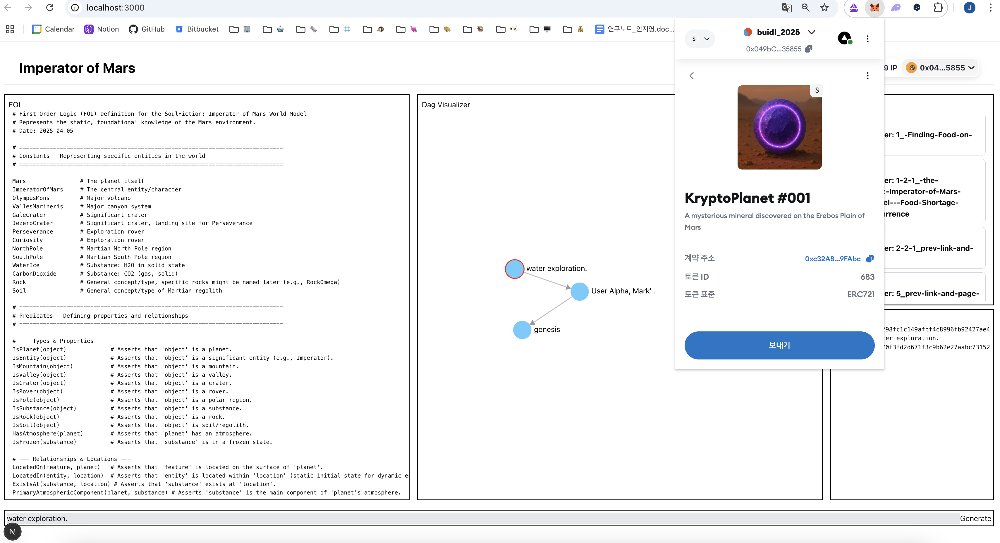

# Story Bounty - Imperator of Mars

Preserve and protect creative **Content IP** assets using Story Protocol

## Overview

Our project enables builders to **mint and register their creative assets** as protected IP on the blockchain using **Story Protocol**.

During the hackathon, we implemented this functionality end-to-end—from **IPFS asset upload**, to **NFT minting**, to **IP registration** via the [Story SDK](https://github.com/storyprotocol/sdk).

By safeguarding the ownership of the **creative building blocks** they produce, we aim to empower a future where IP attribution and licensing are **fair, transparent, and reward creators appropriately**.

## Features

- Upload creative assets to IPFS
- Mint assets as NFTs via Story Protocol
- Register NFTs as formal IP in the Story Blockchain
- Set commercial-remix licensing with derivative works support
- Verify ownership through MetaMask

## Demo Scenario: Claiming IP for the KryptoPlanet Discovery

In the world of _Imperator of Mars_, builders continuously shape the Martian future through bold decisions.  
Every action updates the **narrative DAG**, and sometimes, a discovery is so significant that it deserves to be **minted as IP**.

### 🧭 Step 0. Diverging Paths – Potato Farming vs. Water Exploration

> Two users, **Gamma** and **Delta**, commit to different futures at Node 2.
> - Gamma chooses **Potato Farming** (Path A)
> - Delta chooses **Water Exploration** (Path B)

Both actions are signed through wallet signatures and committed, creating new branches in the narrative DAG.


### ❄️ Step 1. A Monumental Discovery – Echo’s Turn

Following Delta’s branch, **Echo** continues exploration and stumbles upon something remarkable:

> “While surveying near the subsurface ice layers, Echo discovers a glowing mineral—**KryptoPlanet**—unknown to human science.”

This is recorded in **DAG Node**, and immediately recognized as a potential **IP-worthy creative asset**.


### 📦 Step 2. Uploading the Discovery Asset to IPFS
The discovery is visualized and described (text, concept art, scientific notes) and uploaded to IPFS:


### 🪙 Step 3. Mint and Register IP via Story Protocol
Echo mints the asset as an NFT and formally registers it as IP using the Story SDK:

```ts
const response = await client.ipAsset.mintAndRegisterIpAssetWithPilTerms({
  spgNftContract: SPG_NFT_CONTRACT_ADDRESS,
  licenseTermsData: [{ terms: commercialRemixTerms }],
  ipMetadata: {
    ipMetadataURI: `https://ipfs.io/ipfs/${ipIpfsCid}`,
    ipMetadataHash: `0x${ipMetadataHash}`,
    nftMetadataURI: `https://ipfs.io/ipfs/${nftIpfsCid}`,
    nftMetadataHash: `0x${nftMetadataHash}`,
  },
  txOptions: { waitForTransaction: true },
});
console.log(`IPA created at tx hash ${response.txHash}, IPA ID: ${response.ipId}`);
```
This locks authorship and gives Echo on-chain credit for the discovery.



[](https://aeneid.explorer.story.foundation/ipa/0x343424AB42d181FA34b10B53c9702cD2c30D2082)
*Click to navigate to Story Explorer*


### 📄 Step 4. Licensing the Asset for Derivative Use

Echo sets fair licensing rules—allowing others to remix, reuse, or build on **KryptoPlanet**, with attribution and revenue sharing:

```ts
const commercialRemixTerms: LicenseTerms = {
  transferable: true,
  royaltyPolicy: "0xBe54FB168b3c982b7AaE60dB6CF75Bd8447b390E", // RoyaltyPolicyLAP address from https://docs.story.foundation/docs/deployed-smart-contracts
  defaultMintingFee: BigInt(10),
  expiration: BigInt(0),
  commercialUse: true,
  commercialAttribution: true, // must give us attribution
  commercializerChecker: zeroAddress,
  commercializerCheckerData: zeroAddress,
  commercialRevShare: 5, // can claim 50% of derivative revenue
  commercialRevCeiling: BigInt(0),
  derivativesAllowed: true,
  derivativesAttribution: true,
  derivativesApproval: false,
  derivativesReciprocal: true,
  derivativeRevCeiling: BigInt(0),
  currency: WIP_TOKEN_ADDRESS,
  uri: "",
};
```

### Why This Matters

The discovery of KryptoPlanet is no longer just a moment in a story—it’s **preserved, owned, and shared** through IP.  
With Story Protocol, builders like Echo become recognized co-authors of the _Imperator of Mars_ universe.

## Tech Stack
- Story Protocol SDK
- IPFS
- Next.js
- MetaMask
