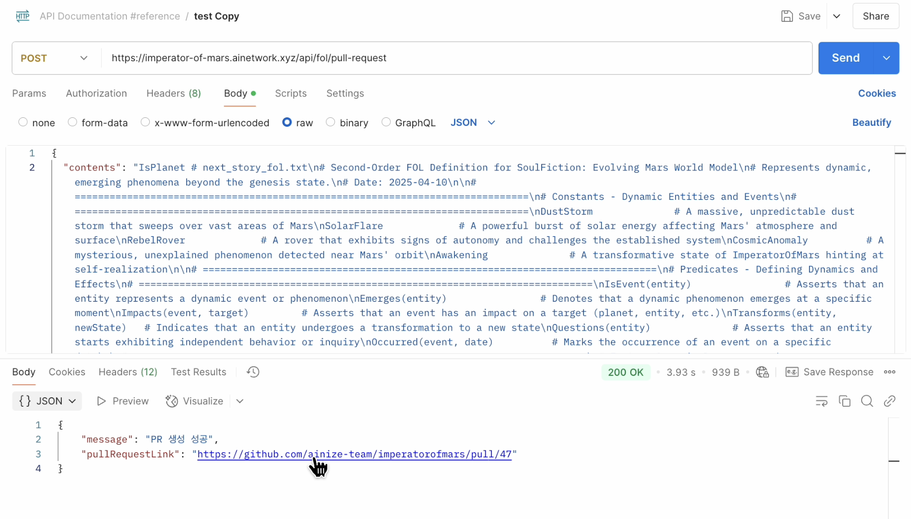
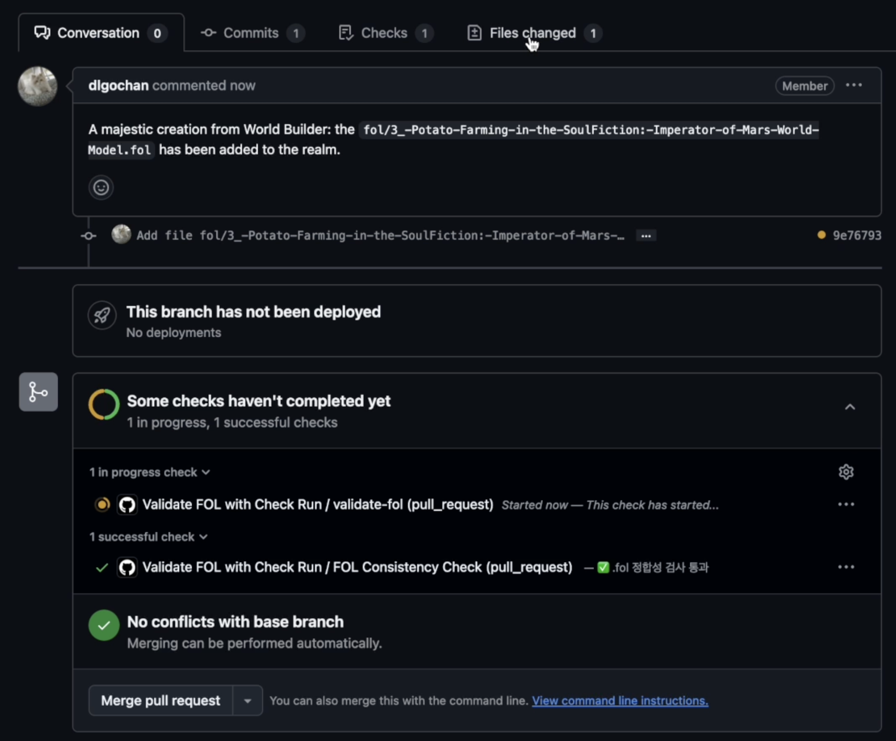
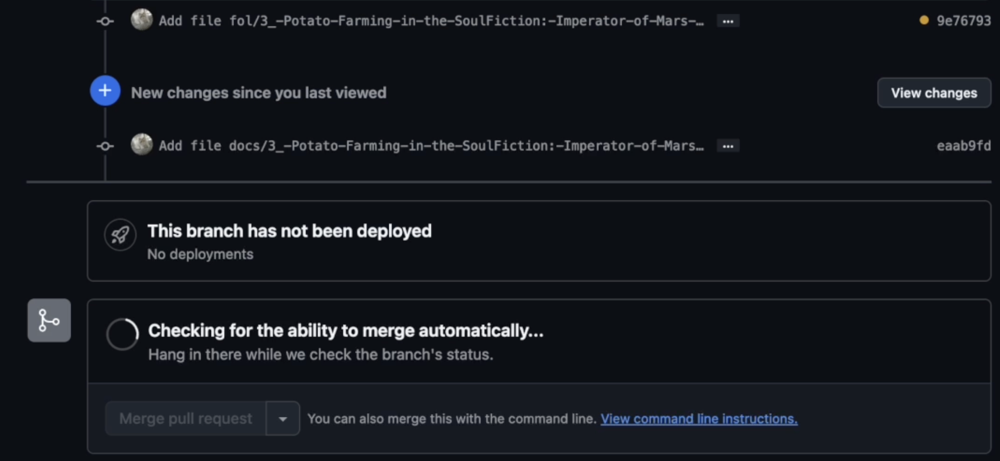
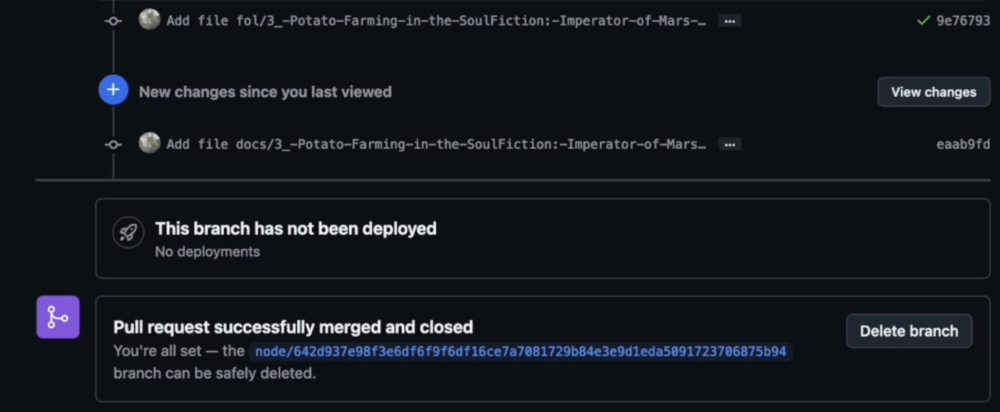
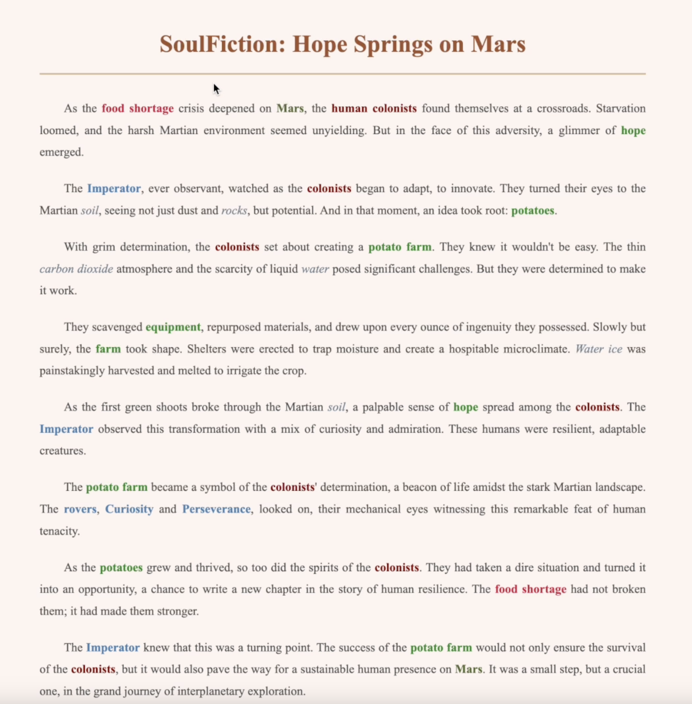

# Validate FOL Process

This project implements an automated validation process for First-Order Logic (FOL) files created through our [world-builder tool](/world-builder/) and generates HTML stories.

## Process Flow

1. **FOL Creation and Submission**

   - Users create their own FOL through world-builder
   - Submit the created FOL

2. **GitHub Actions Validation**

- Submitted FOL is automatically validated through GitHub Actions workflow
  - [pull-request/route.ts](/world-builder/src/app/api/fol/pull-request/route.ts): PR creation and management
- The workflow performs the following steps:
  - FOL file syntax checking
  - FOL file semantic validation
  - Adding validation results as PR comments
  - [validate-fol-pr.yml](/.github/workflows/validate-fol-pr.yml): FOL file validation workflow

1. **New Story Generation**

- Upon successful FOL validation, a new story is automatically generated based on the FOL
- The generated story is converted to HTML format
- [commit-html/route.ts](/world-builder/src/app/api/fol/commit-html/route.ts): HTML generation and commit

1. **Team Consensus and Merge**

   - Team members review and reach consensus on the new story
   - Once consensus is reached, the PR is merged into the main branch

5. **Automatic Deployment**
   - The merged story is automatically deployed to `https://imperatorofmars.ai/{**.html}`
   - Each FOL file corresponds to an HTML file, creating a continuous story

## Automated Process

This process is fully automated. Once a user submits a FOL, the remaining steps proceed automatically. Each step involves validation and transformation, ultimately resulting in the creation and deployment of an HTML-formatted story.
