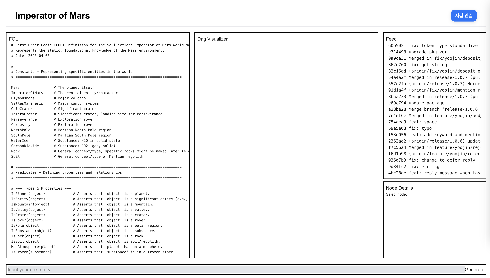

# Imperator of Mars World Builder
The World Builder is a tool that build stories based on Genesis FOL.

## Genesis FOL

[Genesis FOL](https://github.com/ainize-team/imperatorofmars/blob/main/fol/0_genesis_9d5c0ec6bd88c06ddf1f4e696fd338c9844fa74ecd5803c5665bf8475441b2a2.fol) is the fundamental set of rules that govern the narrative.

## Generate The Story
###

Each input generates a story according to the FOL, and a wallet signature is used to transparently manage accountability. 
As the story progresses, the state evolves into a new FOL, which is stored in a DAG.

When a PR is created using the generated FOL, the consistency of the FOL is verified.
A verified PR merged, the FOL and corresponding story are used to automatically publish an HTML version. 
Check [Validate FOL](../validate-fol/README.md)

###

Once the HTML is deployed and the node is stored in the DAG, it can be viewed in the Visualizer.

After selecting a node and entering a prompt for the next part of the story, a new node is generated. Orange-colored nodes provide suggested prompts for the next story segment, allowing you to easily generate the next FOL with a single click.
